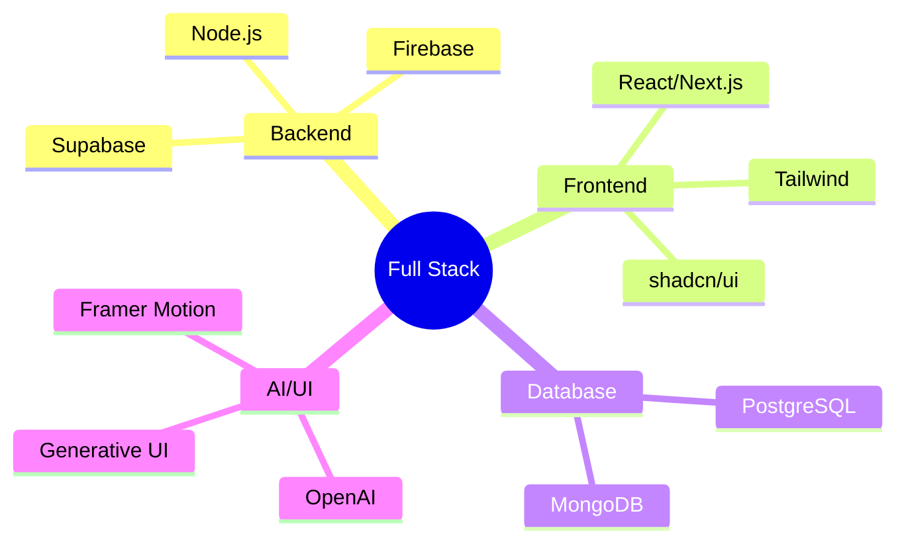

<div align="center">
  
</div>

> *"Building in public isn't just about code—it's about community, growth, and inspiring others."*

# 👨‍💻 Professional Overview
```typescript
const umair = {
  roles: ["Software Engineer", "Tech Entrepreneur", "Open Source Contributor"],
  passions: ["Building Scalable Solutions", "Contributing to Dev Community", "Innovation"],
  motto: "Crafting code that matters, building solutions that scale"
};
```

# 💫 About Me
- 🔭 Currently working as a Software Engineer at [Invotyx](https://invotyx.com)
- 🌱 Exploring dApps development and Web3 technologies
- 🎨 Building with Generative AI and Modern UI frameworks
- ❤️ Passionate about TypeScript and type-level programming
- 🚀 Building microSaaS products to solve real-world problems
- 🤝 Active open source contributor helping fellow developers
- 💡 Living by "Build Fast, Learn Faster, Share Always"

# 🌟 Open Source & Community
- 📚 Mentoring students through [OpenSourceMentors](https://github.com/topics/mentoring)
- 🎓 Creating educational content for aspiring developers
- 💡 Contributing to TypeScript/JavaScript learning resources
- 🤖 Developing free developer tools and utilities

# 🏗️ MicroSaaS Projects
- 🛠️ [Project Name] - Brief description of your microSaaS
- 📊 [Analytics Tool] - Data visualization platform
- 🤖 [AI-Powered Tool] - Generative AI solution
- 💼 More projects coming soon!

# 🎯 Weekend Builder Manifesto
<div align="center">
  <table>
    <tr>
      <td align="center">🌅</td>
      <td align="center">⚡</td>
      <td align="center">🎨</td>
      <td align="center">🚀</td>
    </tr>
    <tr>
      <td>Start Small</td>
      <td>Ship Fast</td>
      <td>Design Better</td>
      <td>Scale Smart</td>
    </tr>
  </table>
</div>


# 🛠️ Technical Arsenal
<div align="center">
  
# 📈 Impact & Contributions
<div align="center">

| Area | Impact |
|------|---------|
| Enterprise Solutions | Building scalable systems serving 100k+ users |
| Open Source | 5+ contributions across major projects |
| Community | Mentored 20+ developers, Created 5+ technical guides |

</div>

### Frontend & UI


### Backend


### Database & Backend-as-a-Service


### AI & Generative UI


</div>

# 🛠️ Weekend SaaS Stack
<div align="center">

### Rapid Prototyping


### Quick Backend Setup


# 📊 GitHub Statistics
<div align="center">
  
  
  
</div>

# 🎓 Education
## [PMAS-Arid Agriculture University Rawalpindi-Pakistan](https://www.uaar.edu.pk/) (2018-2022)
- 🎓 Bachelor of Science (BS), Computer Engineering
- 🏆 Specialized in Software Architecture & System Design
- 📚 Research Focus: Scalable Systems & Modern Web Technologies

# 💻 Latest Tech Stack


# 🤝 Let's Connect!
<div align="center">
  
[](https://linkedin.com/in/umairali5)
[](https://x.com/buildwithumair)
[](https://developedbyumair.github.io)
</div>

---
<div align="center">
  <b>💡 Open to collaborative opportunities and innovative projects!</b>
  
  If you're interested in microSaaS development or need help with open source contributions, feel free to reach out!
</div>
